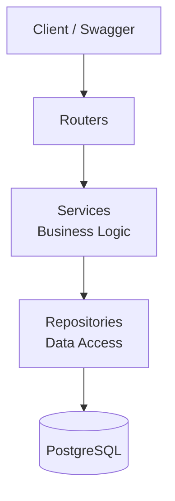
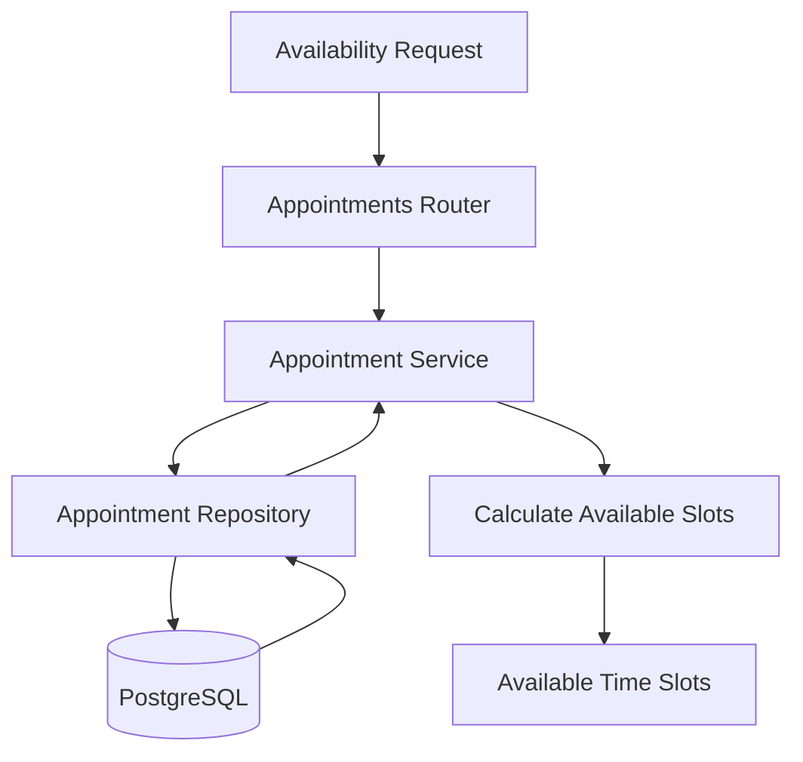

# TerminToGo

> Appointment booking REST API for businesses such as hair salons, barbershops, and other appointment-based services.

Built with **FastAPI**, **PostgreSQL**, **SQLAlchemy**, and **Alembic**, following a clean layered architecture with centralized exception handling and automatic appointment availability calculation.

---

## 🚀 Features

| Feature | Description |
|---|---|
| 🏢 **Business Management** | Create and retrieve businesses |
| 💇 **Service Management** | Manage services, duration, and pricing |
| 📅 **Appointment Management** | Create and retrieve appointments |
| 🕐 **Availability** | Calculate available appointment slots |
| 🗄️ **PostgreSQL** | Relational database for persistent storage |
| 🔄 **Alembic** | Database schema migrations |
| 🏗️ **Layered Architecture** | Routers → Services → Repositories |
| ⚠️ **Error Handling** | Centralized application exception handling |
| 📖 **OpenAPI** | Automatic Swagger API documentation |

---

## 🏗️ Architecture

TerminToGo follows a clean layered architecture that separates API endpoints, business logic, data access, and database operations.



### Architecture Flow

```text
Client
  ↓
Routers
  ↓
Services
  ↓
Repositories
  ↓
PostgreSQL
```

---

## 📅 Appointment Availability

The availability system checks existing appointments and calculates free time slots based on the selected date and service duration.



---

## 📁 Project Structure

```text
TerminToGo/
│
├── core/
│   ├── exceptions.py
│   └── ...
│
├── models/
│   ├── business.py
│   ├── service.py
│   └── appointment.py
│
├── schemas/
│   ├── business.py
│   ├── service.py
│   └── appointment.py
│
├── repositories/
│   ├── business/
│   ├── service/
│   └── appointment/
│
├── services/
│   ├── business/
│   ├── service/
│   └── appointment/
│
├── routers/
│   ├── businesses.py
│   ├── services.py
│   └── appointments.py
│
├── migrations/
│   └── versions/
│
├── main.py
├── alembic.ini
├── docker-compose.yml
├── requirements.txt
└── README.md
```

---

## 🛠️ Tech Stack

- **Python**
- **FastAPI**
- **PostgreSQL**
- **SQLAlchemy**
- **Alembic**
- **Pydantic**
- **Docker**
- **Uvicorn**

---

# ⚙️ Running Locally

## 1. Clone the repository

```bash
git clone https://github.com/irhadTTT/TerminToGo.git
cd TerminToGo
```

## 2. Create a virtual environment

### Windows

```powershell
python -m venv .venv
.venv\Scripts\Activate.ps1
```

## 3. Install dependencies

```bash
pip install -r requirements.txt
```

## 4. Start PostgreSQL

PostgreSQL runs in Docker:

```bash
docker compose up -d postgres
```

Check that the container is running:

```bash
docker compose ps
```

## 5. Run database migrations

```bash
alembic upgrade head
```

## 6. Start the API

```bash
uvicorn main:app --reload
```

The API will be available at:

**http://127.0.0.1:8000**

---

# 📖 API Documentation

### Swagger UI

**http://127.0.0.1:8000/docs**

### ReDoc

**http://127.0.0.1:8000/redoc**

The Swagger interface can be used to test all available endpoints directly from the browser.

---

# 📌 API Endpoints

## 🏢 Businesses

```text
POST   /businesses
GET    /businesses
GET    /businesses/{business_id}
```

## 💇 Services

```text
POST   /services
GET    /services
GET    /services/{service_id}
```

## 📅 Appointments

```text
POST   /appointments
GET    /appointments
GET    /appointments/{appointment_id}
```

## 🕐 Availability

```text
GET /appointments/available
```

Example:

```text
/appointments/available?business_id=1&service_duration=30&date=13-08-2026
```

Returns available appointment slots for the selected business, service duration, and date.

---

# 🗄️ Database Migrations

### Create a new migration

```bash
alembic revision --autogenerate -m "migration description"
```

### Apply migrations

```bash
alembic upgrade head
```

### Rollback the latest migration

```bash
alembic downgrade -1
```

---

# ⚠️ Error Handling

TerminToGo uses centralized application exception handling for consistent API responses.

Example:

```json
{
  "detail": "Business not found"
}
```

Unhandled exceptions are logged internally and return a generic response:

```json
{
  "detail": "Internal server error"
}
```

This prevents internal implementation details from being exposed to API clients.

---

# 🔮 Future Improvements

Potential future improvements include:

- User authentication and authorization
- Appointment cancellation and rescheduling
- Business working hours
- Email notifications
- Automated tests
- CI/CD pipeline
- Production deployment

---

## 📄 License

This project is currently for portfolio and educational purposes.
